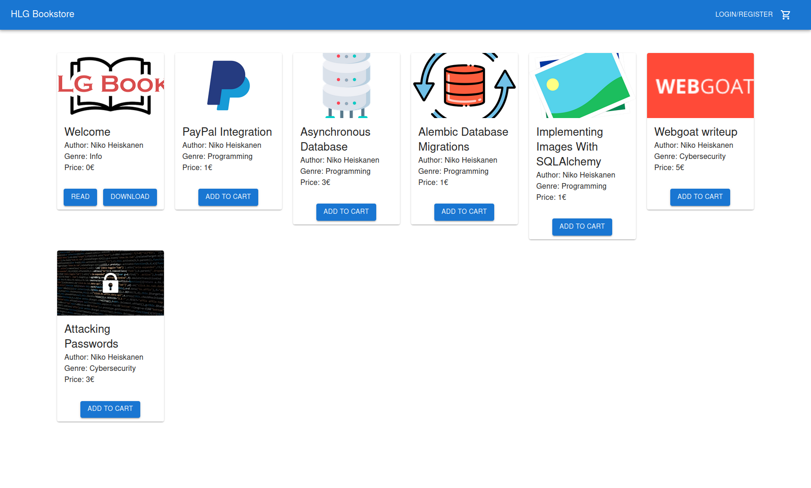
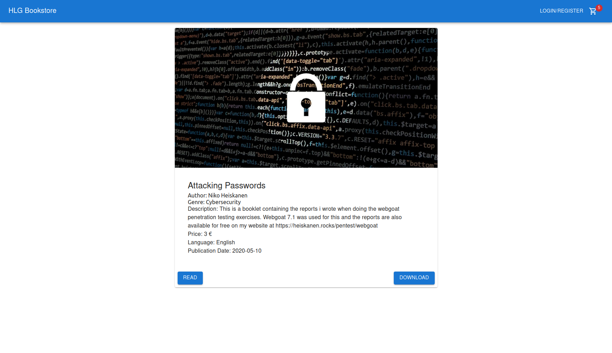
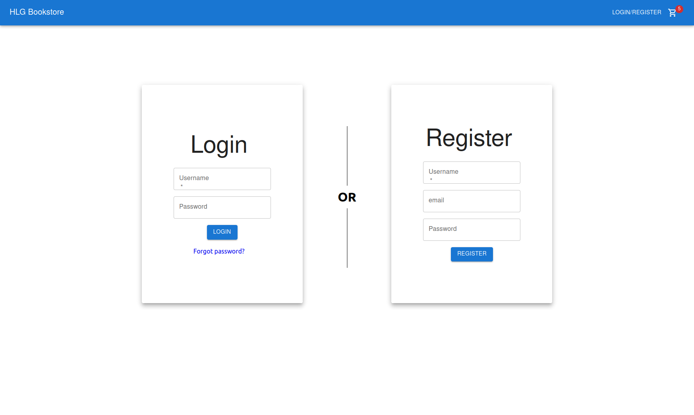

# HLG Bookstore

Visit live deployment at https://hlgbooks.com

## Overview

Live Deployment: https://hlgbooks.com/

Note that the mobile app is part of a diffrent project.
Mobile app: https://play.google.com/store/apps/details?id=com.hlg.books
Mobile app code: https://github.com/heiskane/hlg-books-mobile

This project is an online bookstore that focuses on selling eBooks. For the payments we are using PayPal. We have also implemented user control so that a registered users can have access to the books they have bought for as long as the servers will be up.

## Software
### Backend
The backend is created with the FastAPI library in python because it is fast, easy to use and even creates automatic API documentation which makes the API much easier to understand. More about the backend in the [fastapi_backend folder](fastapi_backend)

### Frontend
For the frontend we are using react to hopefully simplify having multiple people working on it.

