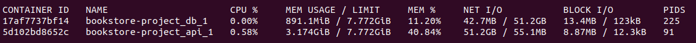

# Async Database

I had noticed in fastapis documentation something about how databases need their own special implementation for async. This made me wonder how much performance i could get out of implementing async. The only answer i could find was "it depends". I understand that it is the only right answer but i still would have wanted atleast some examples of how much faster it could be to communicate to the database asynchronously. I decided that i want to try and implement this in our project to see what i can get out of it and mostly followed [this guide that i found](https://towardsdatascience.com/build-an-async-python-service-with-fastapi-sqlalchemy-196d8792fa08).

I messed around with the code for a while and got all kinds of issues along the way but eventually got it to work. I'll go over the code i used and some of the things i learned along the way. First of all this is how i created the database connection.

```python
from sqlalchemy.ext.asyncio import create_async_engine
from sqlalchemy.orm import sessionmaker

DATABASE_URL = "postgresql+asyncpg://test_user:test_password@db:5432/bookstore_db"

engine = create_async_engine(
  DATABASE_URL,
  future=True,
  echo=True,
  pool_size=50
)

async_session = sessionmaker(engine, expire_on_commit=False, class_=AsyncSession)
```


Note that this uses `asyncpg` instead of `psycopg2`. Next i created a function in my `deps.py` file that will be responsible of creating sessions.

```python
async def get_async_db() -> AsyncSession:
    async with async_session() as session:
        async with session.begin():
            yield session
```

I am using `async with` so that it closes the connection when it is done. Notice what [sqlalchemy documentation says](https://docs.sqlalchemy.org/en/14/orm/session_api.html) about `session.begin()`.

```
sessionmaker acts as a factory for Session objects in the same way as an Engine acts as a factory for Connection objects. In this way it also includes a sessionmaker.begin() method, that provides a context manager which both begins and commits a transaction, as well as closes out the Session when complete, rolling back the transaction if any errors occur
```

As far as i know this means that i do not need to run `session.commit()` manually. Also in hindsight im not sure if the return type is correct in my code but that is the least of my worries right now because this next part is the one with (almost) all of the issues.

Initially i tried using something like this.

```python
from typing import List
from sqlalchemy.future import select
from sqlalchemy.orm import Session, joinedload
from app import models


async def get_all_books(session: Session) -> List[models.Book]:
    stmt = select(models.Book)
    result = await session.execute(stmt)
    return [book for book in result.unique().scalars()]
```

Unfortunately that just gives this cryptic error.

```
sqlalchemy.exc.MissingGreenlet: greenlet_spawn has not been called; can't call await_() here. Was IO attempted in an unexpected place? (Background on this error at: https://sqlalche.me/e/14/xd2s)
```

I spent some time reading and investigating this issue. I eventually stumbeled upon this [presentation by Sebastiaan Zeeff](https://www.youtube.com/watch?v=1Ruy2b8yyBQ) and in it the same error was shown but in diffrent circumstances. In the video the error was caused the the model class using `server_default` argument for the column. I tried the fix suggested in the video anyway and as you might have guessed that did not work. Later on in the video though relationships were brought up and the fact that anything that is being lazy loaded by default causes issues with this asynchronous solution. In the video it seems like the only issue with relationships was that the data from the relationships was not loaded but i suspected (correctly) that this was the cause of the error i was getting. As far as i know this is because lazy loading does not get the data on all relationships unless you explicitly ask for it. For example i have books in the database and these books have authors related to them. When i get a list of books it does not get any data on the authors until i get that data with something like `authors = book.auhors`. This will run another query on the database to get that information (as far as i know).

The solution to this issue in the video is to just add an option to the query to manually get the needed data with `joinedload` so the fixed code looks like this.

```python
from typing import List
from sqlalchemy.future import select
from sqlalchemy.orm import Session, joinedload
from app import models


async def get_all_books(session: Session) -> List[models.Book]:
    stmt = select(models.Book).options(
        joinedload(models.Book.authors)).options(
        joinedload(models.Book.genres))
    result = await session.execute(stmt)
    return [book for book in result.unique().scalars()]
```

This will essentially add `OUTER JOIN`s to the query to get all the data at once as far as i know. Also note that i added `unique()` because of the following error.

```
sqlalchemy.exc.InvalidRequestError: The unique() method must be invoked on this Result, as it contains results that include joined eager loads against collections
```

Finally the simplest part was to create the endpoint to use this new fancy async function.

```python
from typing import Any, List
from fastapi import APIRouter
from fastapi import Depends
from sqlalchemy.ext.asyncio import AsyncSession
from app import async_crud
from app import schemas
from app.api import deps

router = APIRouter()


@router.get("/async_books/", response_model=List[schemas.Book])
async def read_books(session: AsyncSession = Depends(deps.get_async_db)) -> Any:
    return await async_crud.get_all_books(session=session)
```

I am using `router` instead of `app` here because i have separated my endpoints into their own files/routers and im combining it all elsewhere.


Now for the testing. I have run a bunch of tests locally and in the process encountered this error.

```
asyncpg.exceptions.TooManyConnectionsError: sorry, too many clients already
```

I tried just increasing the pool size in my code but eventually realized that this was because of the `max_connections` in postgres. To "fix" this i added more connections for postgres in my docker compose file.

```yml
version: "3.8"
services:
  api:
    build:
      context: ./fastapi_backend
      dockerfile: Dockerfile
    ports:
      - 8000:80
    env_file:
      - .env
    # Dev volume
    # TODO: Make script to run in dev mode
    #volumes:
    #  - ./fastapi_backend/app:/app
    depends_on:
      - db

  db:
    image: "postgres"
    command: postgres -c 'max_connections=500'
    ports:
      - 5432:5432
    env_file:
      - .env
    volumes:
      - database-data:/var/lib/postgresql/data

volumes:
  database-data:
```

Max connections and connection pool is something i will have to play around with but it wasnt the most interesting thing i found. As important as it is to run tests that reflect the expected use case i wanted to see how much better this async solution could be. I wont go too deep into how async works so if you want to know more about it take a look at the explanation in [fastapi documentation](https://fastapi.tiangolo.com/async/). As painful as it is to look at the emojis and some the text it explains things pretty well but to give you a tldr with async functions you can tell the coputer to go do something else while its waiting for something slow like fetching stuff over the network or dealing with big files.

I thought about how i could showcase the usefulness and the obvious thing that came to mind was to make the database slower (as silly as that sounds). I didnt want to setup a database on the other side of the world and that would be a bit much considering i am running everything on the same machine so i decided to just add a lot more books to the database. I used my little python script in a loop to add 100 books to the database. This should make it so getting all the books from the database will take much longer and the asynchronous code can really benefit from being able to do other things while waiting.

## Benchmarks

So finally here are the most interesting benchmarks

### Sync Results
```
$ ab -c 5 -n 100 -k http://127.0.0.1:8000/books/?limit=200

This is ApacheBench, Version 2.3 <$Revision: 1843412 $>
Copyright 1996 Adam Twiss, Zeus Technology Ltd, http://www.zeustech.net/
Licensed to The Apache Software Foundation, http://www.apache.org/

Benchmarking 127.0.0.1 (be patient).....done


Server Software:        uvicorn
Server Hostname:        127.0.0.1
Server Port:            8000

Document Path:          /books/?limit=200
Document Length:        20811 bytes

Concurrency Level:      5
Time taken for tests:   18.193 seconds
Complete requests:      100
Failed requests:        0
Keep-Alive requests:    0
Total transferred:      2093900 bytes
HTML transferred:       2081100 bytes
Requests per second:    5.50 [#/sec] (mean)
Time per request:       909.652 [ms] (mean)
Time per request:       181.930 [ms] (mean, across all concurrent requests)
Transfer rate:          112.40 [Kbytes/sec] received

Connection Times (ms)
              min  mean[+/-sd] median   max
Connect:        0    0   0.0      0       0
Processing:   434  880 264.9    819    1498
Waiting:      434  880 264.9    819    1498
Total:        434  881 264.9    819    1499

Percentage of the requests served within a certain time (ms)
  50%    819
  66%   1029
  75%   1127
  80%   1151
  90%   1262
  95%   1394
  98%   1491
  99%   1499
 100%   1499 (longest request)

 ```
 
### Async Results
```
$ ab -c 5 -n 100 -k http://127.0.0.1:8000/async_books/

This is ApacheBench, Version 2.3 <$Revision: 1843412 $>
Copyright 1996 Adam Twiss, Zeus Technology Ltd, http://www.zeustech.net/
Licensed to The Apache Software Foundation, http://www.apache.org/

Benchmarking 127.0.0.1 (be patient).....done


Server Software:        uvicorn
Server Hostname:        127.0.0.1
Server Port:            8000


Document Path:          /async_books/
Document Length:        20811 bytes


Concurrency Level:      5     
Time taken for tests:   4.175 seconds                         
Complete requests:      100
Failed requests:        0
Keep-Alive requests:    0
Total transferred:      2093900 bytes
HTML transferred:       2081100 bytes
Requests per second:    23.95 [#/sec] (mean)
Time per request:       208.765 [ms] (mean)
Time per request:       41.753 [ms] (mean, across all concurrent requests)
Transfer rate:          489.74 [Kbytes/sec] received

Connection Times (ms)
              min  mean[+/-sd] median   max
Connect:        0    0   0.1      0       0
Processing:   108  199  53.3    188     387
Waiting:      108  198  53.1    187     387
Total:        108  200  53.3    188     387

Percentage of the requests served within a certain time (ms)
  50%    188
  66%    203
  75%    215
  80%    223
  90%    269
  95%    334
  98%    382
  99%    387
 100%    387 (longest request)
```
 
 As seen in the results the asynchronous code performed much much better in this situation. Of course the obvious solution here to make synchronous code perform better would be to just limit the page size to something like 20 books so that there isnt so much waiting and it wont matter that its not async. Well here are the benchmarks with 20 books in the database.

## Sync with 20 books

```
$ ab -c 5 -n 100 -k http://127.0.0.1:8000/books/?limit=200
This is ApacheBench, Version 2.3 <$Revision: 1843412 $>
Copyright 1996 Adam Twiss, Zeus Technology Ltd, http://www.zeustech.net/
Licensed to The Apache Software Foundation, http://www.apache.org/

Benchmarking 127.0.0.1 (be patient).....done


Server Software:        uvicorn
Server Hostname:        127.0.0.1
Server Port:            8000

Document Path:          /books/?limit=200
Document Length:        4083 bytes

Concurrency Level:      5
Time taken for tests:   4.533 seconds
Complete requests:      100
Failed requests:        0
Keep-Alive requests:    0
Total transferred:      421000 bytes
HTML transferred:       408300 bytes
Requests per second:    22.06 [#/sec] (mean)
Time per request:       226.650 [ms] (mean)
Time per request:       45.330 [ms] (mean, across all concurrent requests)
Transfer rate:          90.70 [Kbytes/sec] received

Connection Times (ms)
              min  mean[+/-sd] median   max
Connect:        0    0   0.1      0       1
Processing:   116  219  68.4    213     409
Waiting:      116  218  68.4    212     409
Total:        116  219  68.4    213     409

Percentage of the requests served within a certain time (ms)
  50%    213
  66%    239
  75%    256
  80%    284
  90%    307
  95%    369
  98%    402
  99%    409
 100%    409 (longest request)
```
 
## Async with 20 books

```
$ ab -c 5 -n 100 -k http://127.0.0.1:8000/async_books/
This is ApacheBench, Version 2.3 <$Revision: 1843412 $>
Copyright 1996 Adam Twiss, Zeus Technology Ltd, http://www.zeustech.net/
Licensed to The Apache Software Foundation, http://www.apache.org/

Benchmarking 127.0.0.1 (be patient).....done


Server Software:        uvicorn
Server Hostname:        127.0.0.1
Server Port:            8000

Document Path:          /async_books/
Document Length:        4083 bytes

Concurrency Level:      5
Time taken for tests:   1.340 seconds
Complete requests:      100
Failed requests:        0
Keep-Alive requests:    0
Total transferred:      421000 bytes
HTML transferred:       408300 bytes
Requests per second:    74.62 [#/sec] (mean)
Time per request:       67.004 [ms] (mean)
Time per request:       13.401 [ms] (mean, across all concurrent requests)
Transfer rate:          306.80 [Kbytes/sec] received

Connection Times (ms)
              min  mean[+/-sd] median   max
Connect:        0    0   0.1      0       1
Processing:    26   63  36.9     51     191
Waiting:       26   62  36.9     50     191
Total:         26   63  36.9     51     191

Percentage of the requests served within a certain time (ms)
  50%     51
  66%     57
  75%     63
  80%     70
  90%    132
  95%    161
  98%    184
  99%    191
 100%    191 (longest request)
```
 
 As seen here the synchronous code is getting reasonable results but it is still much much slower compared to async.

## Maybe unrelated issues

So as you may have noticed i have used fairly low concurrency and requests for these benchmarks. I was trying it with much higher values but some how my virtual machine managed to completely freeze. I was looking a bit into why that was happening and noticed my vm running really slow. I eventually ran `docker stats` and saw this.

```bash
CONTAINER ID   NAME                      CPU %     MEM USAGE / LIMIT     MEM %     NET I/O         BLOCK I/O        PIDS
7c25a2cafcc7   bookstore-project_api_1   0.85%     6.51GiB / 7.772GiB    83.76%    111GB / 187MB   225MB / 0B       46
ee7e0ed024b6   bookstore-project_db_1    0.00%     214.9MiB / 7.772GiB   2.70%     165MB / 111GB   53.3MB / 254kB   45
```

Apparently my api was eating all of the memory. I did some more testing and noticed that running the benchmarks was bringing the ram usage up and it was not coming down for some reason. Iteresting enough running apache bench on the async endpoint only brought the ram usage up by 3,4mb while the normal sync endpoint would bring it up by about 55mb. I tried reading about online and it seems like others have had a similar issue but no one seems to know why it is happening. 

For some context i am giving my virtual machine 6 threads and the docker image i am using creates 2 worker processes per core (in this case thread i think). This means that it should create 12 worker processes for my application. I eventually was looking at my processes in htop an i somehow get a feeling that this might have something to do with my issues..


I was trying to look at these with `ps aux` but that showed only 7 processes. After a quick google search i learned that by default htop shows individual threads as separate processes and that all of these werent actually active. I tried running the bechmark on the async endpoint with some higher values and looked at htop again. This time i was something else that looked promising.


I had set the max connections in postgress to 500 just for testing the async stuff but the connection pool on both sync and async engines are at 50 so im expecting to have a bunch of idle connections waiting for something to do but im not sure if im supposed to have 171 of them.

I tried setting the max connections in postgres to 100 and now i was getting up to only 108 processes as expected. Interesting enough now running apache bench against the sync endpoint takes all of the connections and then only gets 500 errors because there is too many clients already. And i dont mean that only first 100 connections are successfull. I mean after that **all** of the connections fail. Even more interesting running the test on the async endpoint only failed 73 out of 1000 requests.

This odd behaviour could mean a few things like maybe the sessions are not being closed in the code, maybe there is some issues with having 2 engines in the code or maybe there is a memory leak somewhere. I tried restarting the containers so i can connect to postgres with `psql` and look at the connections to the database but somehow this gave me more odd behaviour. Now no matter how many times i run the tests to sync and async endpoints the sync endpoint is working flawlessly while the async endpoint is failing about 100 out of 1000 times. The async endpoint giving some errors is to be expected. This is because the max connections is now set to 100 and both engines have a pool of 50 connections. This adds up just right but remember that the async code is going to be fething data before the previous connection is even finished.

At this point i am not sure what is going on but next i tried restarting the containers again and going into psql to look at all of the connections. First i ran the test against sync endpoint then did the same with the async endpoint. I used the following query to look at the connections.

```sql
SELECT pid,pg_stat_activity.usename,query,state FROM pg_stat_activity;
```

Looking at the results i noticed that the connections i noticed that the sync code sessions are showing the query as `ROLLBACK` while the async connections are showing `COMMIT;`. I'm not sure if this really matters. I remember from sqlalchemy documentation that the `session.begin()` that i am using runs a commit automatically and does a rollback if errors occur. At this point i understand that having many idle connections pooled up is going to eat tons of resources but it doesnt explain why the memory usage keeps going up and does not seem to go back down.

I finally had an idea. I restarted then containers again and this time i ran the test on the async endpoint first and with concurrency of 100 a few times. Now when i run the test on the sync endpoint all i get is 500 errors. So my theory here was that the async code is setting up new connections before the old ones being freed and somehow stealing the pooled connections from the other engine. I'm not sure if that is what happened but i do see that the async code managed to occupy all of the 100 connections.

I looked a bit more at my code and noticed that i had set the `max_overflow` value as 0 to the normal engine but not the async engine. According to [sqlalchemy documentation](https://docs.sqlalchemy.org/en/14/core/engines.html#sqlalchemy.create_engine.params.max_overflow) the default for this is 5. I think this might be what is stealing all the pooled connections but im not sure if it explains why it is taking 50 connections more than the assigned pool. I tried setting this value to 0 but it still took all of the connections and failed more requests. I also tried leaving `max_overflow` out and setting the `pool_size` to 10. This seems to have made the performance much worse but the way it uses connections is interesting. It seems to take about 100 connections when running but after the tests i only have 66 idle connections.

I ran some more benchmarks and keps an eye on the memory usage. I got the memory usage to stay up at 1.8gb but it does seem to be going down. So far it seems that the memory related issues were caused by setting the `max_connections` to 500 and maybe the way those would cache something.

`2021-10-16 17:51:32,639 INFO sqlalchemy.engine.Engine [cached since 1432s ago] ()`


I went back and set the `max_connections` to 500 and ran some tests again.



This seems to confirm my expectation but whats next? Maybe i should do some load testing on a vm with similar resourses that it will have in production. Also i will probably have to look more into how the async engine is stealing the sessions and if there is a good middleground of settings where everyone is happy and i dont have to pay for a massive server just to support a theoretical workload that we probably wont encounter. Probably. And i do still want to play around with some new fancy baked queries with lambda functions that i saw in [sqlalchemys notes on the 1.4 release]. Apparently they can make the queries 60% faster so we shall see what happens.