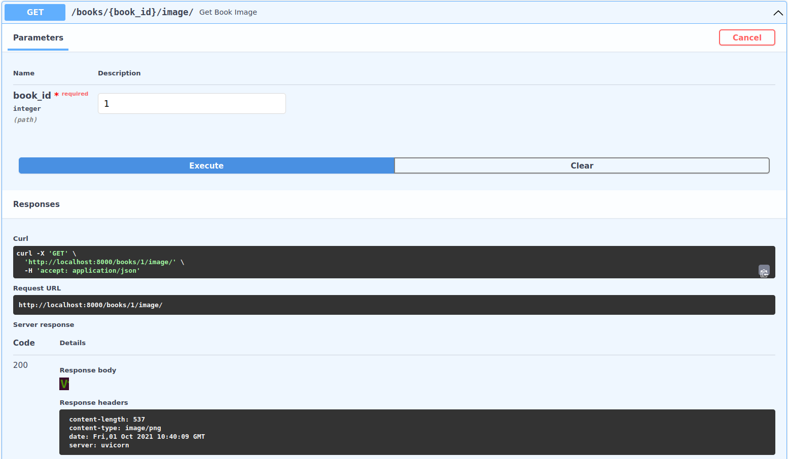

# Images

I have been thinking for a while about how i want to implement images for our project structure. Ideally i want it to be manditory to specify an image when creating a book but there are some issues with that. When creating a book i am expecting json data so the content type is set to "application/json" and i cant take an image with that because of a [limitation of the HTTP protocol](https://github.com/heiskane/Bookstore-Project/commit/52301fc596d1a871bef1709d8d3ebfdc0a5a606e). Well the obvious solution is then just to use base64 and thats what i ended up using but initially i was going to **only** use base64. Tero Karvinen informed me that this would be pretty slow and that i could just decode the base64 encoded image and put it in the database.

I started off by adding an image attribute to my `BookCreate` schema.

* `schemas.py`:

```python

[...snip...]

class BookBase(BaseModel):
	title: str
	description: Optional[str] = None
	language: Optional[str] = None
	price: float = 0
	publication_date: date
	isbn: Optional[str] = None


class BookCreate(BookBase):
	image: str
	genres: List[str]


class Book(BookBase):
	id: int
	authors: List['Author']
	genres: List[Genre]

	class Config:
		orm_mode = True

```

To create a database field to put the image in i modified my `Book` model to include an `image` column that uses `LargeBinary` as the datatype. There was some [ImageAttach extension](https://sqlalchemy-imageattach.readthedocs.io/en/1.1.0/) in sqlalchemy that i briefly considered but quickly decided that it was too complicated for what i was doing.

```python
[...snip...]

class Book(Base):
	__tablename__ = "books"

	id = Column(Integer, primary_key=True, index=True)
	title = Column(String, index=True)
	description = Column(String, index=True)
	language = Column(String, index=True)
	price = Column(Float, index=True)
	publication_date = Column(Date, index=True)
	#publisher = Column(String, index=True)
	isbn = Column(String, index=True)
	image = Column(LargeBinary, index=True)

	authors = relationship(
		"Author",
		secondary=book_author,
		back_populates="books"
	)

	genres = relationship(
		"Genre",
		secondary=book_genre,
		back_populates="books"
	)

	owners = relationship(
		"User",
		secondary=book_ownership,
		back_populates='books'
	)
```

From there i used pythons `base64` library to decode the base64 and put it back into the book object

```python
from base64 import decodebytes

[...snip...]

def create_book(db: Session, book: schemas.BookCreate, authors: List[schemas.AuthorCreate]):
	
	# Get existing genres and create the new ones
	db_genres = []
	for genre_name in book.genres:
		db_genre = get_genre_by_name(db=db, name=genre_name)
		if not db_genre:
			db_genres.append(create_genre(db=db, genre=schemas.GenreCreate(name=genre_name)))
		else:
			db_genres.append(db_genre)

	book.genres = [genre for genre in db_genres]

	db_authors = []
	for author in authors:
		db_author = get_author_by_name(db=db, name=author.name)
		if not db_author:
			db_authors.append(create_author(db=db, author=author))
		else:
			db_authors.append(db_author)

	image_file = decodebytes(book.image.encode('utf-8'))
	book.image = image_file
	
	db_book = models.Book(**book.dict(), authors=db_authors)

	db.add(db_book)
	db.commit()
	db.refresh(db_book)
	return db_book
```

Trying to make sure it actually work gave me some trouble because of JSON formatting not liking my copy pasting. To make sure i wasnt copying extra data i used to the following command to copy an image as base64.

```bash
base64 test.png -w0 | xclip -select clip
```

So the JSON data for creating a book now looks like this

```json
{
  "authors": [
    {
      "name": "string"
    }
  ],
  "book": {
    "title": "string12313",
    "description": "string",
    "language": "string",
    "price": 0,
    "publication_date": "2021-10-01",
    "isbn": "string",
    "image": "iVBORw0KGgoAAAANSUhEUgAAABEAAAAXCAYAAADtNKTnAAAABHNCSVQICAgIfAhkiAAAAdBJREFUOI3tlE1uE0EQhb/+m/GMrShGSiwHwo8IG07AIhyCyyAOwFm4ABdAYssCRYhEASwSZYMSE1Bij7vnp1n0EI899iobFvSqq+b1q/eqq0c86z313HLJ2xL8QySiRIedx7w4of+8CNGHIedvuovgrUv6L8cYBeQpV693yK4WlAiKkxj/t8XbOXpJoxi4ee6iQz6p91417HxPKMr6wJZF6iaFR911CBGi6rRDUc2/3kD9rw75WGAGHmKL2fa4s/qUqND38hooKUYx3PlN/9U5RjcbW8W4bxIPIHLMTqOUdOhhHZcxbqQQDZ0N54L8OAEPCI964G6AYsOhN+pg3MFdgs8i7PtNpu82WXQ+SnH5NXEEcneGlAllBexmaFUL+ZKGXJYwfZssKwEmKe401BeDjKgbmqofzZAC8Ir8KGb5nSySeI07rEHaYu5XIAvMw/raZgl21J7PVqY86lKWgCgxexaRZJhhqO2/dslti2PF2P9IsRfBknySoR5nGAN4ifuUUq14822SKsJ9Dv0Wgwm9/WkYMpdgD1WbYSUJguKgG25AWaK9EgFUxz3cpI1eQwL+rIf92Uwo8o+rrawloYyZHURzjixltsYKgPj/e2ytP0Bvq196uVzkAAAAAElFTkSuQmCC",
    "genres": [
      "string", "string2", "Thriller"
    ]
  }
}
```

I was curious about what the image is going to look like in the database so took a look at it and sqlite seems to just show `PNG`. This is good enogh for me to confirm that an image is in the database.

```bash
$ sqlite3 bookstore_app.db 
SQLite version 3.31.1 2020-01-27 19:55:54
Enter ".help" for usage hints.
sqlite> SELECT * FROM books;
1|string12313|string|string|0.0|2021-10-01|string|PNG
```

Finally showing the image to the frontend turned out to be the easiest part. I just imported `Response` and responded with the image for the appropriate book.

```python
from fastapi.responses import Response

[...snip...]

@app.get("/books/{book_id}/image/")
def get_book_image(book_id: int, db: Session = Depends(get_db)):
	book = crud.get_book(db = db, book_id = book_id)
	return Response(book.image, media_type='image/png')
```

Note that im setting the `media_type` as `image/png`. This will probably mean that any other file type wont work so ill have to fix that at some point. Either way testing the image endpoint through the docs responds with the image i used so it all seems to work just fine.

